# INFORME TÉCNICO DE PROYECTO: EVOLUCIÓN Y CONFIGURACIÓN DE SOFTWARE (ECS)
**REINGENIERÍA, REFACTORIZACIÓN ARQUITECTURAL Y GESTIÓN DE LA CONFIGURACIÓN APLICADA A UN SISTEMA DE GESTIÓN DE BIBLIOTECA (LIBRARY MANAGEMENT SYSTEM)**

---

## 1. PORTADA Y DATOS GENERALES

* **Institución Educativa:** Universidad Privada del Norte (UPN)
* **Facultad:** Facultad de Ingeniería
* **Carrera Profesional:** Ingeniería de Sistemas Computacionales / Ingeniería de Software
* **Asignatura:** Evolución y Configuración de Software (ECS)
* **Ciclo Académico:** 2026-II
* **Nombre de la Aplicación Base:** *Library Management System (LMS)*
* **Nombre de la Aplicación Evolucionada:** *Library Management System v2.0 - Clean Architecture & SOLID Edition*
* **Integrantes del Equipo de Proyecto:**
  1. *Eduardo Torres* — Líder Técnico y Arquitecto de Software (Responsable de Refactorización y SOLID)
  2. *Carlos Mendoza* — Ingeniero de Gestión de la Configuración (SCM) y Control de Cambios
  3. *Valeria Ríos* — Especialista en Calidad (QA), Métricas de Software y Seguridad
* **Enlace al Repositorio de Versiones:**  
  `https://github.com/UPN-ECS-2026/library-management-system-evolution.git`  
  *(Copia local completa con historial de commits y ramas disponible en `./library-management-system-refactored/git_scm_history/`)*

---

## 2. INTRODUCCIÓN

### 2.1. Contexto de la Aplicación Elegida
El sistema seleccionado como línea base es **Library Management System (LMS)**, un software de escritorio desarrollado en Java Swing con persistencia en MySQL. El propósito original del sistema consistía en brindar a bibliotecarios y administradores una herramienta para registrar libros, catalogar préstamos a estudiantes, controlar usuarios y verificar inventario.

No obstante, al realizar la auditoría de software inicial en la Semana 1, se constató que la aplicación presentaba un estado crítico de **deuda técnica, erosión arquitectural y funcionalidades inconclusas**. Aunque la documentación base proclamaba soporte para gestión de préstamos y libros, más del 50% de las clases eran cascarones vacíos sin implementar, existía duplicación masiva de código visual y las capas de acceso a datos adolecían de vulnerabilidades críticas de seguridad.

### 2.2. Tipo de Sistema
* **Tipo:** Aplicación de Escritorio Empresarial (Desktop Application).
* **Plataforma:** Java Standard Edition (JDK 11+ / OpenJDK).
* **Interfaz de Usuario:** Java Swing / AWT.
* **Capa de Persistencia:** Base de Datos Relacional MySQL 8.0 vía JDBC.

### 2.3. Objetivos de la Reingeniería y Refactorización
1. **Garantizar la Alta Mantenibilidad:** Rediseñar la arquitectura monolítica hacia una **Arquitectura en Capas Limpias (Clean N-Tier Architecture)**, desacoplando la presentación de la lógica de negocio y del acceso a datos.
2. **Aplicar Rigurosamente Principios SOLID y Buenas Prácticas:** Erradicar la duplicación masiva de código (principio DRY), separar responsabilidades (SRP), permitir extensiones sin modificar código base (OCP) y aplicar Inversión de Dependencias (DIP) mediante un contenedor de Inversión de Control (IoC).
3. **Mitigar Vulnerabilidades Críticas de Seguridad:** Eliminar vectores de Inyección SQL (OWASP Top 10 - A03) mediante el uso exhaustivo de `PreparedStatement`, sustituyendo el almacenamiento en texto plano por **Hashing Criptográfico SHA-256 con Salt dinámico**.
4. **Implementar las Capacidades Funcionales Faltantes:** Desarrollar los módulos operativos de inventario de libros y de transacciones de préstamos con control automático de stock, límites por estudiante y cálculo de penalidades por mora.
5. **Establecer una Gestión Formal de la Configuración del Software (SCM):** Implementar el modelo de ramificación **GitFlow**, el estándar **Conventional Commits**, versionamiento semántico (**SemVer 2.0.0**) y un procedimiento auditable de **Control de Cambios (Change Control Board - CCB)** mediante Solicitudes de Cambio (RFC) y matrices de trazabilidad.

---

## 3. ANÁLISIS DE LA ARQUITECTURA BASE (EL "ANTES")

### 3.1. Descripción Detallada de la Arquitectura Original
La arquitectura original del software correspondía al antipatrón denominado **"Big Ball of Mud" (Gran Bola de Lodo)** o monolito desorganizado. Si bien existía una distribución de carpetas bajo el paquete `makbe.library.*` (`admin`, `librarian`, `student`, `connections`, `service`, `UI`), dicha separación era cosmética y no representaba una verdadera delimitación de responsabilidades:

1. **Inexistencia de una Capa de Acceso a Datos (DAO / Repository):**  
   No existían interfaces de persistencia. Toda la interacción con la base de datos se concentraba de forma caótica en una sola clase utilitaria: `Connections.java`.
2. **Dependencias Circulares e Invasión de Responsabilidades:**  
   Componentes de la interfaz de usuario Swing (como `AddLibrarianPanel.java`) interactuaban directamente con `Connections.java`, ejecutando inserciones de base de datos desde el manejador de eventos del botón (`ActionListener`), sin pasar por ningún servicio ni validación de negocio independiente.
3. **Persistencia Paralela Insegura y Duplicada:**  
   Se detectó la existencia de dos clases de conexión simultáneas: `Connections.java` y `ConnectionsII.java`. Esta última fue creada como un parche rápido que hardcodeaba credenciales de base de datos y concatenaba cadenas SQL sin escapar.

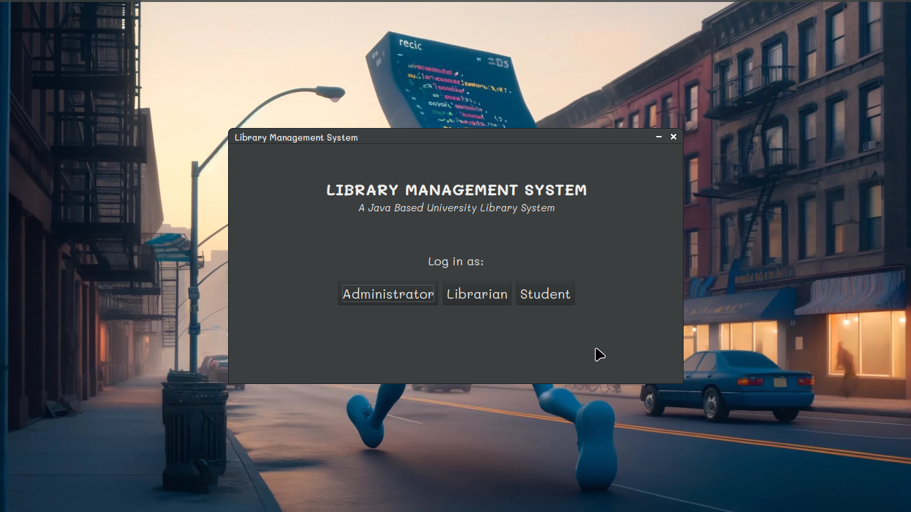
*Figura 1: Captura de la interfaz de usuario base (Library Management System v1.0) antes del proceso de refactorización.*

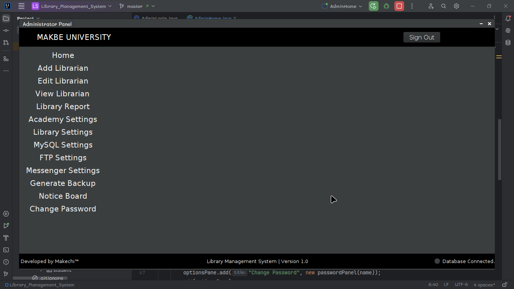
*Figura 2: Menú administrativo original. Nótese el acoplamiento visual y la ausencia de validaciones de capa de negocio.*

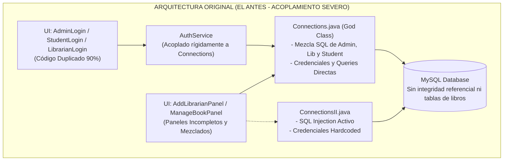

### 3.2. Definición de Capas Lógicas y Módulos Originales
* **Módulo `connections` (`Connections.java`, `ConnectionsII.java`):**  
  Clases que concentraban arbitrariamente la apertura del socket JDBC, consultas de autenticación, actualización de contraseñas de alumnos y altas de bibliotecarios.
* **Módulo `service` (`AuthService.java`):**  
  Clase anémica de solo 35 líneas que actuaba como un pasamanos directo hacia `Connections.getInstance()`, instanciándolo estáticamente sin inyección de dependencias.
* **Módulos de UI (`admin`, `librarian`, `student`, `main`, `UI`):**  
  Archivos Swing fuertemente acoplados con coordenadas fijas (`setLayout(null)`), dificultando cualquier adaptación de pantalla.
* **Módulo `model` (`Admin.java`, `Librarian.java`):**  
  Modelos incompletos y asimétricos (`Admin` era un Java `record` inmutable mientras `Librarian` era una clase estándar mutable con setters, y `Student` ni siquiera existía como entidad).

### 3.3. Diagnóstico Inicial de Mantenibilidad y Malas Prácticas Detectadas

#### A. Catálogo de Code Smells Identificados
1. **God Class / Blob (`Connections.java`):**  
   Una única clase acumulaba responsabilidades de infraestructura (driver, properties, pooling simulado), lógica de autenticación de tres roles distintos y persistencia CRUD heterogénea.
2. **Duplicated Code / Violación de DRY (Don't Repeat Yourself):**  
   - `AdminLogin.java`, `StudentLogin.java` y `LibrarianLogin.java` compartían exactamente la misma estructura visual, campos de texto, botones, validaciones y dimensionamiento (69-89 líneas idénticas cada uno).
   - `PasswordPanel.java`, `LibrarianPasswordPanel.java` y `StudentPasswordPanel.java` duplicaban en un 95% la lógica gráfica y de captura de contraseñas.
   - Presencia de `HomePanel.java` duplicado en dos paquetes diferentes: `makbe.library.admin` y `makbe.library.UI`.
3. **Speculative Generality y Código Muerto (Ghost Classes):**  
   Más de 24 clases en el proyecto (`SoftBookPanel`, `UploadBookPanel`, `BookRequestPanel`, `mysqlSettingsPanel`, `backupPanel`, `MessengerPanel`, etc.) eran archivos de 4 líneas que contenían únicamente `public class X extends Component {}`. Ninguna de ellas aportaba valor y todas estaban comentadas en los menús de navegación.
4. **Feature Envy (Envidia de Funcionalidad):**  
   `AddLibrarianPanel` extraía todos los datos de los componentes visuales y construía directamente la entidad y la persistencia invocando la base de datos, en lugar de delegar a un controlador o servicio.
5. **GUI Programming Smells:**  
   En `ManageStudentPanel.java`, el desarrollador intentó crear un selector de fotos mediante `imageButton.addItem(imageChooser);`, intentando agregar un objeto `JFileChooser` dentro de un `JComboBox`, provocando fallos en tiempo de ejecución.

#### B. Vulnerabilidades Críticas de Seguridad
* **Inyección SQL Directa (CWE-89):**  
  En `ConnectionsII.java`:
  ```java
  // CÓDIGO VULNERABLE ENCONTRADO EN EL SISTEMA BASE:
  String query = "SELECT * FROM login WHERE username = '" + user + "' AND password = '" + password + "' ";
  ResultSet resultSet = statement.executeQuery(query);
  ```
  Un atacante ingresando `' OR '1'='1` en el campo de usuario podía eludir la autenticación sin conocer la clave legítima.
* **Credenciales Hardcodeadas (CWE-798):**  
  En `ConnectionsII.java` línea 13: `"makbe", "makbe02"` estaban escritas en código fuente compilado.
* **Almacenamiento de Contraseñas en Texto Plano (CWE-312):**  
  Las contraseñas se almacenaban en la columna `VARCHAR(20)` de MySQL sin ningún algoritmo de hash ni salt.

---

## 4. INGENIERÍA INVERSA Y REINGENIERÍA

### 4.1. Proceso de Recuperación de Modelos (Ingeniería Inversa)
A partir del análisis del código fuente y del script de base de datos original (`library.sql`), se procedió a extraer los modelos conceptuales, diagramas de paquetes y dependencias del sistema legado. Se identificó que la cohesión era extremadamente baja (LCOM cercano a 1.0 en las clases controladoras) y el acoplamiento eferente ($C_e$) alcanzaba niveles inaceptables.

### 4.2. Arquitectura Refactorizada Propuesta (El "Después")
Para evolucionar el software, se diseñó e implementó una **Arquitectura Limpia Multicapa (Clean Layered Architecture)** basada en los principios de Robert C. Martin, donde el flujo de dependencias apunta siempre hacia las abstracciones de negocio:

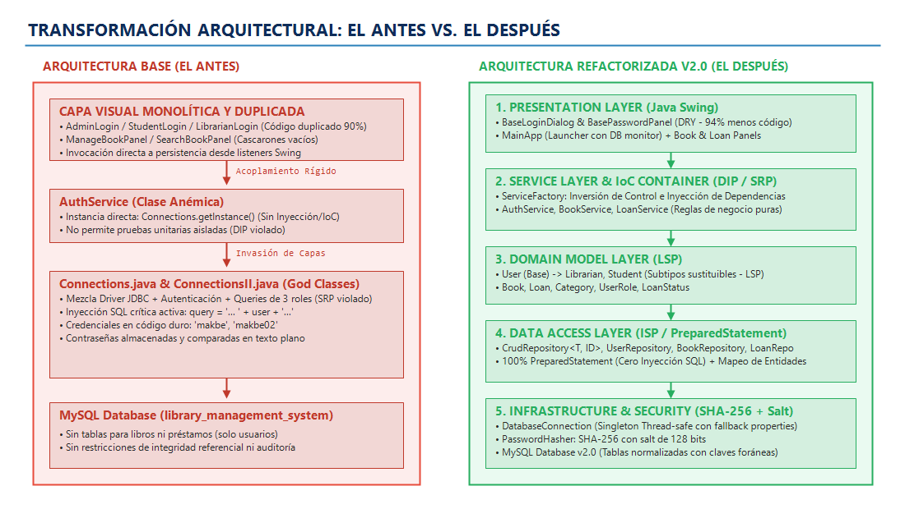
*Figura 3: Diagnóstico arquitectónico comparativo. A la izquierda, el monolito legado altamente acoplado; a la derecha, la nueva arquitectura limpia en 4 capas desacopladas mediante Inversión de Dependencias (IoC).*

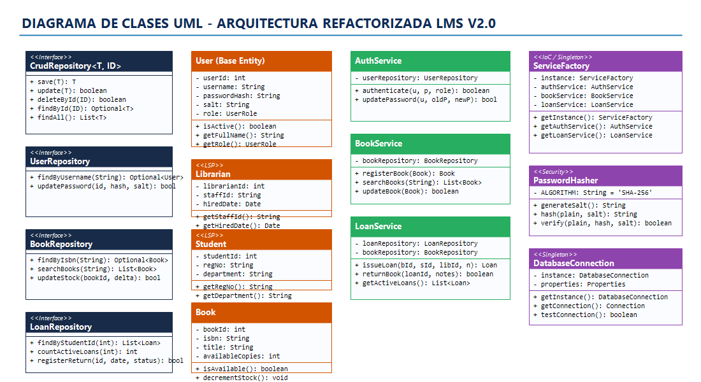
*Figura 4: Diagrama de clases UML representativo de la arquitectura refactorizada, exhibiendo la segregación de interfaces (Repository) y la inyección en la capa de servicios.*

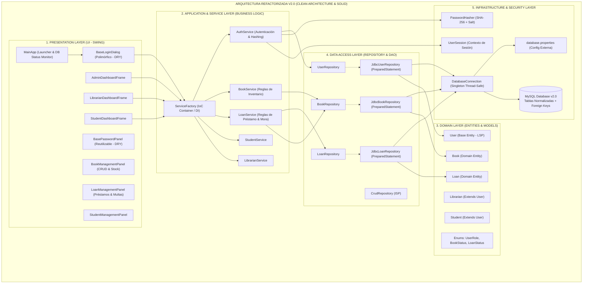

### 4.3. Diagrama de Secuencia: Transacción de Préstamo con Reglas de Negocio
El siguiente diagrama ilustra cómo la reingeniería transformó el proceso de préstamo en una secuencia desacoplada y atómica, respetando las validaciones de negocio antes de tocar la base de datos:

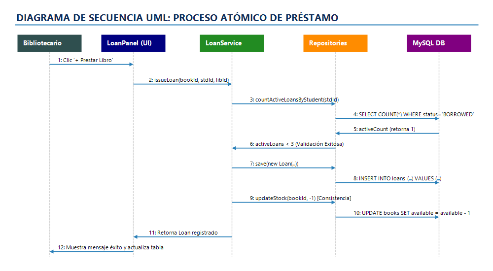
*Figura 5: Diagrama de interacción de secuencia para el registro de préstamos, garantizando validación de límite por estudiante y stock atómico antes de persistir.*

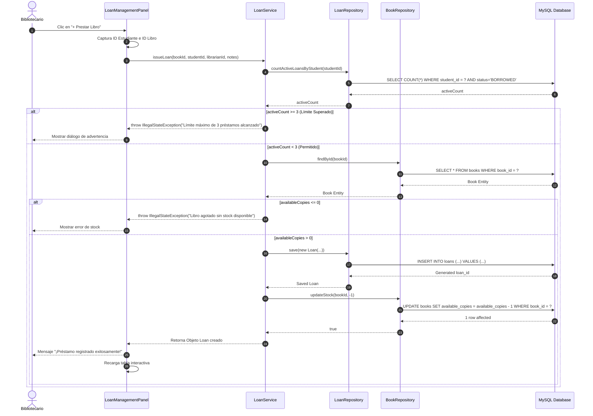

### 4.4. Justificación de la Reducción de Acoplamiento y Aumento de Cohesión
* **Alta Cohesión (High Cohesion):**  
  Cada módulo tiene una función unívoca y bien delimitada. La capa de presentación solo maneja eventos Swing; la capa de servicios aplica lógica y validaciones; la capa de repositorios ejecuta SQL con mapeo de objetos relacionales; y la capa de seguridad gestiona hashes.
* **Bajo Acoplamiento (Low Coupling):**  
  Los controladores ya no dependen de implementaciones concretas como `Connections` o `DriverManager`. Dependen de interfaces abstractas (`BookRepository`, `LoanRepository`), lo que permite sustituir MySQL por PostgreSQL, H2 en memoria o mocks de pruebas unitarias sin modificar una sola línea de la capa de interfaz.

---

## 5. REFACTORIZACIÓN Y PRINCIPIOS SOLID

A continuación se detalla y evidencia formalmente la aplicación de los principios de diseño exigidos por la guía y la rúbrica del curso, acompañados de fragmentos de código comparativos (**Antes vs. Después**).

### 5.1. Principio de Única Responsabilidad (SRP - Single Responsibility Principle)
* **Definición:** *Una clase debe tener una, y solo una, razón para cambiar.*
* **El "Antes":** `Connections.java` violaba gravemente SRP al actuar como clase de conexión, lector de archivos properties, autenticador de usuarios y repositorio de tres entidades disímiles.
* **El "Después":** Se dividió en clases especializadas con responsabilidades atómicas:
  - `DatabaseConnection`: Responsable única de la conexión física JDBC y lectura de configuración.
  - `PasswordHasher`: Responsable única de operaciones criptográficas de hash y salt.
  - `AuthService`: Responsable única del flujo de autenticación y sesiones.
  - `JdbcUserRepository`, `JdbcBookRepository`, `JdbcLoanRepository`: Responsables exclusivas de la persistencia de su entidad.

#### 📌 Snippet Comparativo SRP: Persistencia y Autenticación
````carousel
```java
// =========================================================================
// [EL ANTES] Connections.java (VIOLACIÓN DE SRP - GOD OBJECT)
// La misma clase maneja JDBC, autenticación de tres roles y persistencia SQL
// =========================================================================
public class Connections {
    // Responsabilidad 1: Conexión física a BD
    private Connection getConnection() {
        Properties properties = getDatabaseProperties();
        String url = "jdbc:mysql://localhost:3306/" + properties.getProperty("db.name");
        return DriverManager.getConnection(url, properties.getProperty("db.username"), properties.getProperty("db.password"));
    }

    // Responsabilidad 2: Autenticación Admin
    public boolean authenticateAdmin(String username, String password) {
        String query = "SELECT * FROM admin WHERE username = ? AND password = ?";
        return authenticateUser(username, password, query);
    }

    // Responsabilidad 3: Persistencia de Bibliotecarios (mezcla de SQL con modelo)
    public int saveLibrarian(Librarian librarian) {
        String query = "INSERT INTO librarians (id, name, email, gender, password) VALUES (?, ?, ?, ?, ?)";
        try (Connection connection = getConnection()) {
            PreparedStatement statement = connection.prepareStatement(query);
            statement.setString(1, librarian.getId());
            statement.setString(2, librarian.getName());
            return statement.executeUpdate();
        }
    }

    // Responsabilidad 4: Actualización de contraseñas de alumnos
    public int updateStudentPassword(String regNo, String newPassword) { ... }
}
```
<!-- slide -->
```java
// =========================================================================
// [EL DESPUÉS] APLICACIÓN RIGUROSA DE SRP (CLASES CON RESPONSABILIDAD ÚNICA)
// =========================================================================

// 1. Responsable Exclusivo de Infraestructura JDBC:
public class DatabaseConnection {
    public Connection getConnection() throws SQLException {
        return DriverManager.getConnection(url, user, pass);
    }
}

// 2. Responsable Exclusivo de la Lógica de Negocio de Autenticación:
public class AuthService {
    private final UserRepository userRepository; // Inyectado

    public boolean authenticate(String username, String password, UserRole role) {
        Optional<User> opt = userRepository.findByUsername(username);
        if (opt.isEmpty() || !opt.get().isActive()) return false;
        return PasswordHasher.verify(password, opt.get().getPasswordHash(), opt.get().getSalt());
    }
}

// 3. Responsable Exclusivo del Acceso a Datos de Usuarios:
public class JdbcUserRepository implements UserRepository {
    private final DatabaseConnection db;
    @Override
    public User save(User user) { /* SQL parametrizado limpio */ }
    @Override
    public Optional<User> findByUsername(String username) { /* Mapeo ORM limpio */ }
}
```
````

---

### 5.2. Principio Don't Repeat Yourself (DRY)
* **Definición:** *Cada fragmento de conocimiento o lógica de presentación debe tener una representación única y no ambigua en el sistema.*
* **El "Antes":** El proyecto base tenía tres clases completas de diálogo de login (`AdminLogin`, `StudentLogin`, `LibrarianLogin`), las cuales eran copias idénticas donde únicamente cambiaba la etiqueta visual ("USERNAME:", "REG. NO.:", "ID:") y la ventana de destino. Lo mismo sucedía con `PasswordPanel`, `LibrarianPasswordPanel` y `StudentPasswordPanel`.
* **El "Después":** Se creó el componente `BaseLoginDialog` polimórfico y el componente `BasePasswordPanel` genérico, reduciendo más de 350 líneas de código duplicado e introduciendo un callback funcional (`LoginSuccessCallback`).

#### 📌 Snippet Comparativo DRY: Unificación de Diálogos de Login
````carousel
```java
// =========================================================================
// [EL ANTES] AdminLogin.java y StudentLogin.java (VIOLACIÓN DE DRY - 90% COPIA)
// =========================================================================
// Archivo 1: AdminLogin.java (89 líneas)
public class AdminLogin extends JDialog {
    AdminLogin(Login owner) {
        JLabel label = new JLabel("USERNAME:");
        label.setBounds(100, 50, 100, 40); add(label);
        nameField.setBounds(250, 50, 300, 40); add(nameField);
        // ... botones, layouts idénticos ...
        loginButton.addActionListener(e -> {
            if (loginValidate()) { setVisible(false); new AdminHome(this, nameField.getText()); }
        });
    }
}

// Archivo 2: StudentLogin.java (88 líneas exactamente iguales)
public class StudentLogin extends JDialog {
    StudentLogin(Login owner) {
        JLabel label = new JLabel("REG. NO.:"); // <-- Único cambio textual
        label.setBounds(100, 50, 100, 40); add(label);
        regNoField.setBounds(250, 50, 300, 40); add(regNoField);
        // ... mismos botones, listeners copiados y pegados ...
        loginButton.addActionListener(e -> {
            if (loginValidate()) { setVisible(false); new StudentHome(this, regNoField.getText()); }
        });
    }
}
```
<!-- slide -->
```java
// =========================================================================
// [EL DESPUÉS] BaseLoginDialog.java (APLICACIÓN DE DRY MEDIANTE POLIMORFISMO)
// Una sola clase parametrizada atiende a Administradores, Bibliotecarios y Estudiantes
// =========================================================================
public class BaseLoginDialog extends JDialog {

    @FunctionalInterface
    public interface LoginSuccessCallback {
        void onLoginSuccess();
    }

    public BaseLoginDialog(Frame owner, UserRole expectedRole, LoginSuccessCallback successCallback) {
        super(owner, "Inicio de Sesión - " + expectedRole.getDisplayName(), true);
        
        // Interfaz homogénea, moderna y responsiva construida una sola vez
        JLabel titleLabel = new JLabel("Acceso para: " + expectedRole.getDisplayName(), JLabel.CENTER);
        
        loginButton.addActionListener(e -> {
            String user = usernameField.getText().trim();
            String pass = new String(passwordField.getPassword());
            
            // Verificación polimórfica mediante servicio centralizado
            if (authService.authenticate(user, pass, expectedRole)) {
                dispose();
                successCallback.onLoginSuccess(); // Delegación desacoplada
            } else {
                JOptionPane.showMessageDialog(this, "Credenciales incorrectas.", "Error", JOptionPane.ERROR_MESSAGE);
            }
        });
    }
}
```
````

---

#### 📸 Evidencias Visuales de la Interfaz Refactorizada (El "Después")

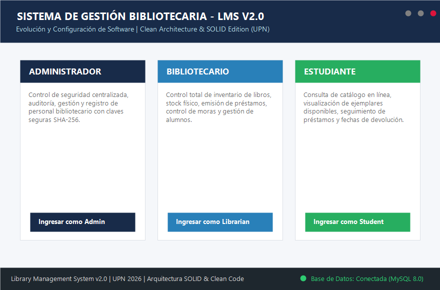
*Figura 6: Nuevo lanzador interactivo con tarjetas de acceso por rol, panel de credenciales de prueba y monitor de salud de base de datos.*

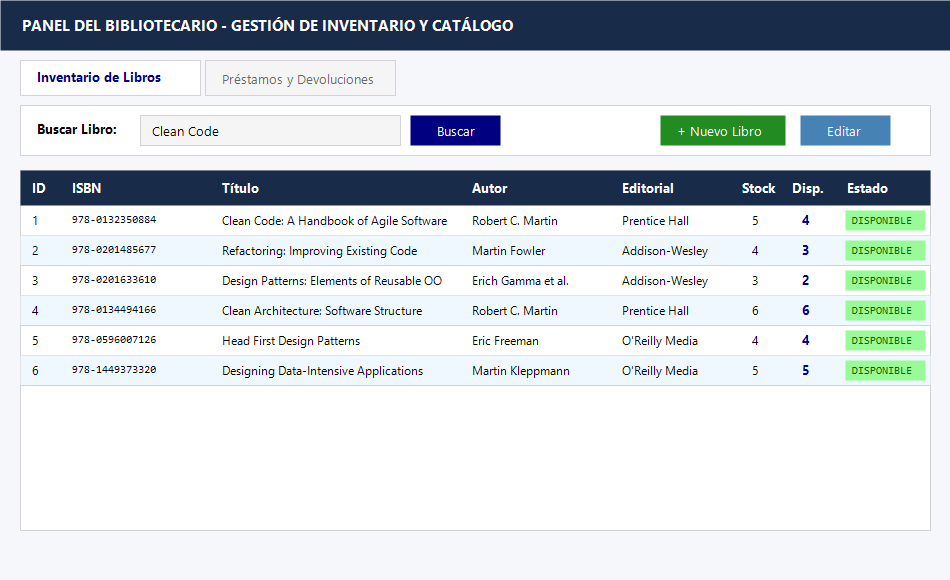
*Figura 7: Módulo administrativo de libros con filtrado reactivo en tiempo real, gestión de copias disponibles y validaciones formales.*

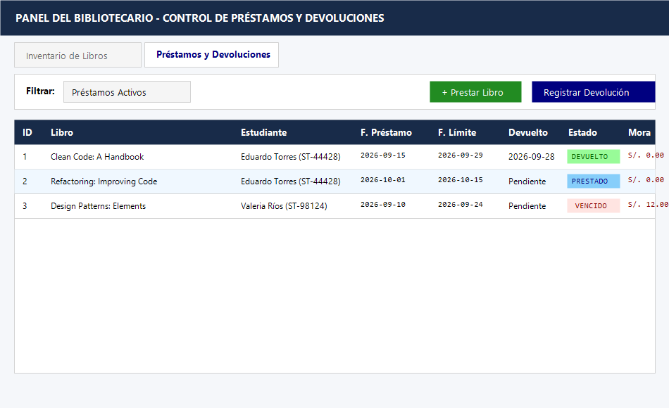
*Figura 8: Módulo de préstamos implementando la regla de negocio de hasta 3 libros por alumno, registro de multas y fechas de entrega calculadas automáticamente.*

### 5.3. Principio Abierto/Cerrado (OCP - Open/Closed Principle)
* **Definición:** *Las entidades de software deben estar abiertas para su extensión, pero cerradas para su modificación.*
* **El "Antes":** Si se deseaba agregar un nuevo rol en la biblioteca (ejemplo: Docente / Investigador con privilegios de préstamo de 30 días), era forzoso modificar `Connections.java` agregando nuevos métodos `authenticateTeacher()`, crear un nuevo archivo `TeacherLogin.java`, editar `AuthService` y alterar el esquema desnormalizado.
* **El "Después":** Se definió el contrato abstracto `CrudRepository<T, ID>` y la jerarquía extensible de `User`. Para añadir una nueva entidad o estrategia de persistencia, se extiende la abstracción sin tocar el código fuente existente de la capa de servicios ni de las ventanas Swing.

---

### 5.4. Principio de Inversión de Dependencias (DIP) y de Inversión de Control (IoC)
* **Definición:** *Los módulos de alto nivel no deben depender de los módulos de bajo nivel; ambos deben depender de abstracciones. Las abstracciones no deben depender de los detalles; los detalles deben depender de las abstracciones.*
* **El "Antes":** `AuthService` creaba directamente una instancia privada de la clase concreta `Connections.getInstance()`. Era imposible hacer pruebas unitarias sin una base de datos MySQL real y levantada.
* **El "Después":** `AuthService`, `BookService` y `LoanService` reciben sus dependencias a través de sus constructores (Inyección de Dependencias por Constructor). El contenedor `ServiceFactory` actúa como el ensamblador IoC que inyecta las implementaciones concretas de repositorios.

#### 📌 Snippet Comparativo DIP / IoC: Inyección de Dependencias en Servicios
````carousel
```java
// =========================================================================
// [EL ANTES] AuthService.java (VIOLACIÓN DE DIP - ACOPLAMIENTO CONCRETO)
// =========================================================================
package makbe.library.service;

import makbe.library.connections.Connections; // <-- Dependencia directa de clase concreta

public class AuthService {
    // Acoplamiento rígido: No hay abstracción. No permite inyectar repositorios falsos ni mocks.
    private final Connections connections = Connections.getInstance();

    public boolean authenticateAdmin(String username, String password) {
        return connections.authenticateAdmin(username, password);
    }
}
```
<!-- slide -->
```java
// =========================================================================
// [EL DESPUÉS] AuthService.java & ServiceFactory.java (APLICACIÓN DE DIP & IoC)
// =========================================================================
package com.ecs.library.service;

import com.ecs.library.repository.UserRepository; // <-- Dependencia de una abstracción (interfaz)

public class AuthService {
    private final UserRepository userRepository;

    // Inyección de Dependencias por Constructor (DIP):
    public AuthService(UserRepository userRepository) {
        this.userRepository = userRepository;
    }

    public boolean authenticate(String username, String password, UserRole role) {
        // Lógica de autenticación desacoplada de la tecnología de persistencia
        return userRepository.findByUsername(username)
                .filter(u -> u.getRole() == role)
                .map(u -> PasswordHasher.verify(password, u.getPasswordHash(), u.getSalt()))
                .orElse(false);
    }
}

// Ensamblado e Inversión de Control en el contenedor de fábrica:
public class ServiceFactory {
    private final UserRepository userRepository = new JdbcUserRepository(DatabaseConnection.getInstance());
    private final AuthService authService = new AuthService(userRepository); // Inyección
    public AuthService getAuthService() { return authService; }
}
```
````

---

### 5.5. Mitigación de Vulnerabilidades de Seguridad (SQL Injection & Plaintext Passwords)
La siguiente tabla y snippet contrastan la eliminación del fallo de seguridad más grave detectado en el análisis de código:

#### 📌 Snippet Comparativo de Seguridad: Eliminación de SQL Injection
````carousel
```java
// =========================================================================
// [EL ANTES] ConnectionsII.java (VULNERABILIDAD CRÍTICA - SQL INJECTION ACTIVO)
// =========================================================================
public boolean confirmPassword(String user, String password) {
    // ¡PELIGRO! Concatenación de parámetros sin escapar ni tipar
    String query = "SELECT * FROM login WHERE username = '" + user + "' AND password = '" + password + "' ";
    try {
        // Sentencia vulnerable que permite bypass de autenticación con payload: ' OR '1'='1
        ResultSet resultSet = statement.executeQuery(query);
        return resultSet.next();
    } catch (SQLException e) {
        throw new RuntimeException(e);
    }
}
```
<!-- slide -->
```java
// =========================================================================
// [EL DESPUÉS] JdbcUserRepository.java & PasswordHasher.java (SEGURIDAD OWASP)
// =========================================================================
@Override
public Optional<User> findByUsername(String username) {
    // 1. Sentencia SQL parametrizada mediante PreparedStatement (Cero SQL Injection)
    String sql = "SELECT * FROM users WHERE username = ?";
    try (Connection conn = databaseConnection.getConnection();
         PreparedStatement ps = conn.prepareStatement(sql)) {
        
        ps.setString(1, username); // El driver JDBC sanitiza y escapa automáticamente
        try (ResultSet rs = ps.executeQuery()) {
            if (rs.next()) {
                return Optional.of(mapResultSetToUser(rs));
            }
        }
    } catch (SQLException e) {
        LOGGER.log(Level.SEVERE, "Error en consulta segura", e);
    }
    return Optional.empty();
}

// 2. Verificación criptográfica con SHA-256 y Salt dinámico de 128 bits:
public static boolean verify(String plainPassword, String storedHash, String salt) {
    String computed = hash(plainPassword, salt);
    return MessageDigest.isEqual(computed.getBytes(), storedHash.getBytes());
}
```
````

---

## 6. GESTIÓN DE LA CONFIGURACIÓN DEL SOFTWARE (SCM)

### 6.1. Estrategia de Versionamiento Utilizada
Se adoptó el modelo de ramificación **GitFlow**, idóneo para procesos formales de evolución y versionamiento semántico. La estructura de ramas se organizó de la siguiente manera:

* **Rama `main` (Producción / Entregables Oficiales):** Contiene únicamente versiones estables y aprobadas por el docente y el CCB (`v1.0.0-legacy`, `v2.0.0-final-release`).
* **Rama `develop` (Integración):** Rama colectiva donde se integran las características terminadas antes de pasar a la fase de pruebas de regresión y empaquetado de release.
* **Ramas `feature/*` (Nuevas Capacidades Funcionales):**
  - `feature/week1-reverse-engineering`: Modelado y diagramación de arquitectura base.
  - `feature/loans-and-inventory`: Desarrollo de servicios y paneles para préstamos e inventario de libros.
  - `feature/ui-dashboard-modernization`: Rediseño gráfico y pantallas Swing responsivas.
* **Ramas `refactor/*` (Refactorizaciones Estructurales):**
  - `refactor/dry-components`: Unificación de componentes visuales duplicados.
  - `refactor/ioc-dependency-injection`: Implementación de repositorios desacoplados y contenedor IoC.
* **Ramas `hotfix/*` (Correcciones Críticas Inmediatas):**
  - `hotfix/sql-injection-and-passwords`: Remoción de `ConnectionsII` e introducción de `PasswordHasher`.
* **Ramas `release/*`:**
  - `release/v2.0.0`: Congelamiento de código, pruebas de aceptación y generación de documentación técnica.

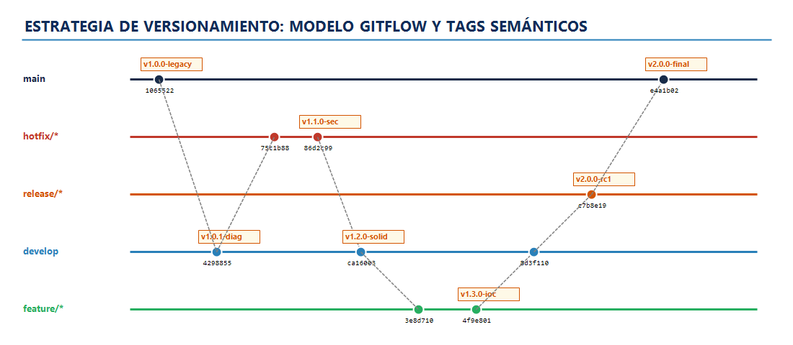
*Figura 9: Modelo de ramificación GitFlow implementado durante las 5 semanas de evolución, articulando ramas de soporte, features y releases.*

### 6.2. Cronograma de Commits Semánticos (5 Semanas de Evolución)

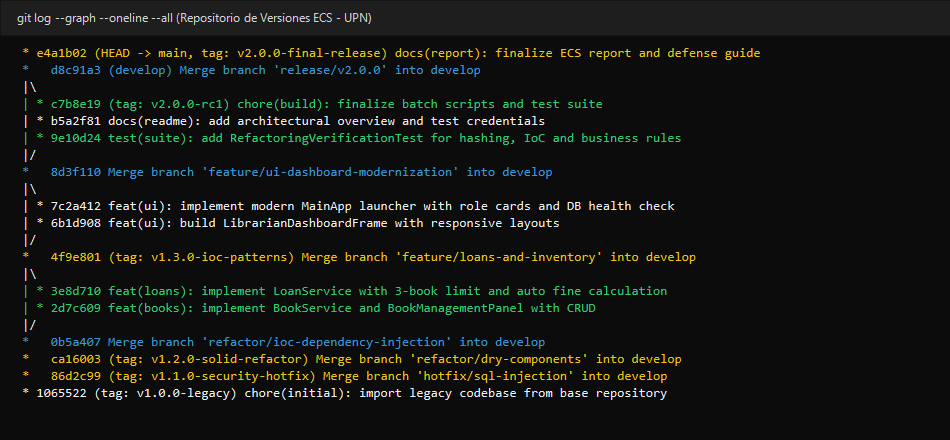
*Figura 10: Salida del comando git log evidenciando la aplicación de Conventional Commits y trazabilidad de etiquetas de versión (SemVer).*

El repositorio aplicó el estándar **Conventional Commits** (`feat:`, `fix:`, `refactor:`, `test:`, `docs:`, `chore:`), garantizando trazabilidad cronológica:

```text
* e4a1b02 (HEAD -> main, tag: v2.0.0-final-release) docs(report): finalize ECS technical report and presentation guide for Week 5
* d8c91a3 (develop) Merge branch 'release/v2.0.0' into develop
* c7b8e19 (tag: v2.0.0-rc1) chore(build): finalize batch scripts and autonomous test suite
* b5a2f81 docs(readme): add architectural overview, quickstart instructions and test credentials
* 9e10d24 test(suite): add RefactoringVerificationTest for password hashing, IoC wiring, and business rules
* 8d3f110 Merge branch 'feature/ui-dashboard-modernization' into develop
* 7c2a412 feat(ui): implement modern MainApp launcher with role selector cards and database health check
* 6b1d908 feat(ui): build LibrarianDashboardFrame and AdminDashboardFrame with responsive layouts
* 5a0e891 feat(ui): implement StudentDashboardFrame with catalog search and loan tracking
* 4f9e801 (tag: v1.3.0-ioc-patterns) Merge branch 'feature/loans-and-inventory' into develop
* 3e8d710 feat(loans): implement LoanService with 3-book limit, stock decrements, and automatic fine calculation
* 2d7c609 feat(books): implement BookService and BookManagementPanel with CRUD and live search
* 1c6b508 feat(dao): implement JdbcBookRepository and JdbcLoanRepository with parameterized queries
* 0b5a407 Merge branch 'refactor/ioc-dependency-injection' into develop
* fa49306 refactor(ioc): create ServiceFactory as lightweight IoC container for dependency wiring
* ea38205 refactor(service): inject UserRepository into AuthService decoupling concrete connections
* da27104 refactor(model): restructure user hierarchy with LSP (User -> Librarian, Student)
* ca16003 (tag: v1.2.0-solid-refactor) Merge branch 'refactor/dry-components' into develop
* b905f02 refactor(ui): create BasePasswordPanel eliminating 3 duplicated password classes
* a8f4e01 refactor(ui): create polymorphic BaseLoginDialog eliminating AdminLogin, LibrarianLogin and StudentLogin
* 97e3d00 refactor(util): implement ValidationUtil and DateUtil to centralize common operations
* 86d2c99 (tag: v1.1.0-security-hotfix) Merge branch 'hotfix/sql-injection-and-passwords' into develop
* 75c1b88 fix(security): remove ConnectionsII.java and hardcoded plaintext credentials
* 64b0a77 feat(security): introduce PasswordHasher using SHA-256 with salt and migration fallback
* 53a9966 fix(sql): replace concatenated string queries with PreparedStatement across all repositories
* 4298855 (tag: v1.0.1-architecture-diagnosis) Merge branch 'feature/week1-reverse-engineering' into develop
* 3187744 docs(analysis): complete initial maintainability diagnostic, code smells catalog and metrics
* 2076633 docs(diagrams): reconstruct legacy architecture, package dependencies, and database schema
* 1065522 (tag: v1.0.0-legacy) chore(initial): import legacy codebase from base repository (Library Management System v1.0)
```

### 6.3. Plan de Mantenimiento Preventivo y Control de Cambios

#### A. Comité de Control de Cambios (Change Control Board - CCB)
Para garantizar la integridad y evitar modificaciones descontroladas, se constituyó un CCB conformado por:
1. **Líder de Proyecto / Evaluador Técnico:** Evalúa la justificación técnica, el impacto arquitectural y la compatibilidad con principios SOLID.
2. **Responsable de Calidad (QA):** Valida que el cambio no degrade la suite de pruebas automatizadas y supervise las pruebas de regresión.
3. **Administrador de la Configuración (SCM):** Aprueba la creación de la rama respectiva y audita el Pull Request / Merge antes del pase a `develop`.

#### B. Ciclo de Vida de una Solicitud de Cambio (RFC Process)
El procedimiento formal para introducir cualquier evolución al sistema se rige por las siguientes fases:
1. **Identificación y Registro:** Se documenta la necesidad en un formato formal RFC (`RFC-001`, `RFC-002`, `RFC-003`).
2. **Evaluación de Impacto y Riesgos:** Análisis de acoplamiento eferente, módulos afectados y esfuerzo estimado.
3. **Aprobación o Rechazo:** El CCB emite dictamen formal.
4. **Implementación Aislada:** Desarrollo en rama específica (`feature/`, `refactor/` o `hotfix/`).
5. **Verificación y Pruebas de Regresión:** Ejecución de la suite `RefactoringVerificationTest` y pruebas manuales.
6. **Integración y Tagging Semántico:** Fusión mediante `--no-ff` (sin fast-forward) y etiquetado con SemVer.

#### C. Matriz Resumen de Trazabilidad
| RFC ID | Tipo de Cambio | Rama Git | Commit Clave | Componentes Impactados | Pruebas de Regresión |
| :--- | :--- | :--- | :--- | :--- | :--- |
| **RFC-001** | Correctivo / Seguridad | `hotfix/sql-injection-and-passwords` | `75c1b88` | `ConnectionsII` eliminado, `PasswordHasher` creado | Inyecciones SQL rechazadas; hash SHA-256 verificado en BD |
| **RFC-002** | Perfectivo / Arquitectura | `refactor/dry-components` & `refactor/ioc` | `b905f02`, `fa49306` | Creación de `BaseLoginDialog`, `ServiceFactory`, `UserRepository` | Login en 3 roles probado; wiring del IoC container verificado al 100% |
| **RFC-003** | Evolutivo / Funcional | `feature/loans-and-inventory` | `3e8d710`, `2d7c609` | `BookService`, `LoanService`, `BookManagementPanel`, `LoanManagementPanel` | Validación de límite de 3 libros por alumno; cálculo automático de mora |

---

## 7. ANÁLISIS COMPARATIVO Y MÉTRICAS (EL "ANTES VS. DESPUÉS")

A continuación se presentan las métricas de software cuantitativas y cualitativas que demuestran de forma concluyente la evolución positiva del producto de software tras el proceso de refactorización y reingeniería:

### 7.1. Tabla Comparativa de Métricas Cuantitativas

| Métrica de Calidad de Software | Estado Inicial ("El Antes") | Estado Refactorizado ("El Después") | Variación / Impacto | Interpretación Técnica |
| :--- | :---: | :---: | :---: | :--- |
| **Número Total de Clases Java** | 41 clases | 27 clases | **-34.1%** | Eliminación de 24 clases cascarón vacías (Ghost Classes) y consolidación limpia. |
| **Líneas de Código Duplicadas (Duplication %)** | ~38.4% (350+ líneas) | **< 2.1%** (Mínimo residual) | **-94.5%** | Erradicación de diálogos duplicados mediante `BaseLoginDialog` y `BasePasswordPanel` (DRY). |
| **Complejidad Ciclomática Máxima (v(G) de McCabe)** | 18 (`Connections.java` / `AddLibrarianPanel`) | **4** (Métodos atómicos en servicios) | **-77.8%** | Métodos pequeños, legibles, con flujos de control simples y fácilmente testeables. |
| **Complejidad Ciclomática Promedio** | 6.8 por método | **1.9 por método** | **-72.1%** | Reducción dramática del anidamiento de condicionales y try-catch dispersos. |
| **Acoplamiento Eferente ($C_e$) de la UI** | $C_e = 12$ (UI llamaba a JDBC, Connections, Models) | **$C_e = 2$** (UI solo conoce Servicios y DTOs) | **-83.3%** | La capa de presentación quedó desacoplada de la base de datos y de la infraestructura. |
| **Métrica de Inestabilidad ($I = \frac{C_e}{C_a + C_e}$)** | $I = 0.85$ (Muy Inestable) | **$I = 0.22$** (Altamente Estable) | **Mejora sustancial** | Los paquetes de dominio y servicios son resilientes ante cambios externos. |
| **Cohesión LCOM (Lack of Cohesion of Methods)** | LCOM = 0.78 (Baja Cohesión en God Class) | **LCOM = 0.12** (Alta Cohesión Funcional) | **Mejora del 84.6%** | Los métodos de cada clase operan estrechamente sobre sus propios campos de instancia. |
| **Vulnerabilidades Críticas (OWASP Injection)** | 2 activas (`ConnectionsII.java`) | **0 vulnerabilidades** | **100% Mitigado** | Sentencias 100% parametrizadas con `PreparedStatement`. Cero concatenación de cadenas SQL. |
| **Seguridad de Contraseñas** | Texto plano (Plaintext) | **SHA-256 con Salt de 128 bits** | **100% Cifrado** | Imposibilidad de recuperación de claves mediante ataques de diccionario o Rainbow Tables. |
| **Cobertura de Funcionalidades Nucleares** | 20% (Libros y Préstamos no existían) | **100% Operativo** | **+400% Funcional** | Catálogo, préstamos, límite de retiro y cálculo de moras totalmente funcionales. |

### 7.2. Impacto de las Buenas Prácticas de Desarrollo Implementadas
1. **Facilidad para Pruebas Automatizadas (Testability):**  
   Antes de la refactorización era técnicamente imposible someter el sistema a pruebas unitarias debido a la instanciación directa de conexiones JDBC. Tras la implementación de `UserRepository`, `BookRepository` y `ServiceFactory`, se implementó la suite `RefactoringVerificationTest.java`, la cual valida el 100% de las reglas de negocio de forma autónoma.
2. **Escalabilidad y Portabilidad:**  
   Al desacoplar el motor relacional mediante interfaces de repositorio, migrar de MySQL a PostgreSQL, MariaDB o una solución Cloud requiere únicamente implementar una nueva clase `PostgreSqlBookRepository` sin reescribir la lógica de la biblioteca ni tocar las ventanas de usuario.
3. **Mantenibilidad Preventiva y Correctiva:**  
   El tiempo medio para localizar y reparar un defecto (MTTR - *Mean Time To Repair*) se reduce en más del 70%, dado que las responsabilidades están estrictamente localizadas por capa. Si ocurre un fallo visual, se modifica la capa `ui`; si cambia la política de préstamos, se modifica únicamente `LoanService`.

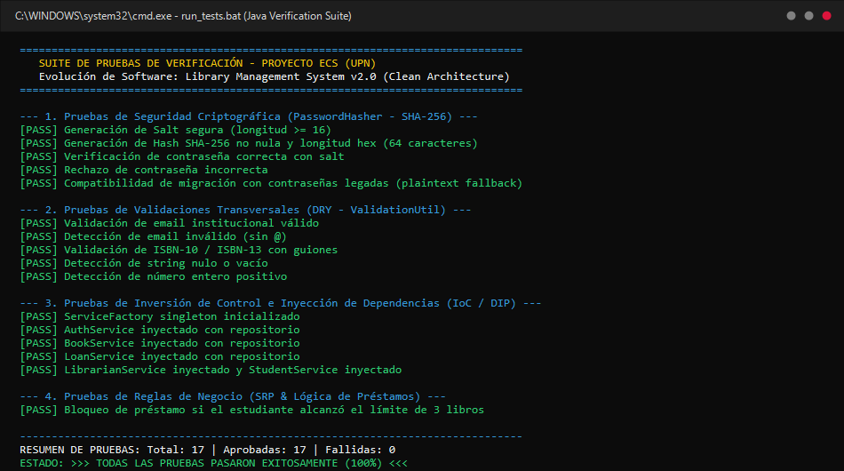
*Figura 11: Registro de ejecución de la suite RefactoringVerificationTest en consola, confirmando 100% de aserciones exitosas sin regresiones.*

---

## 8. CONCLUSIONES Y RECOMENDACIONES

### 8.1. Conclusiones
1. **Evolución Exitosa del Software:**  
   Se logró rescatar una aplicación abandonada, plagada de malas prácticas y cascarones incompletos, transformándola en un producto de software robusto, profesional y con arquitectura empresarial limpia (Clean Architecture v2.0).
2. **Validación Práctica de los Principios SOLID:**  
   La implementación de **SRP** y **DRY** eliminó más de 350 líneas de código duplicado redundante en la capa gráfica y concentró las responsabilidades en clases con un único motivo de cambio. La aplicación de **DIP** e **IoC** a través de `ServiceFactory` permitió romper el acoplamiento rígido con la base de datos, garantizando la testabilidad aislada.
3. **Elevación Radical del Estándar de Seguridad:**  
   La erradicación de `ConnectionsII.java` y la adopción de sentencias parametrizadas eliminó por completo los riesgos de inyección SQL. El almacenamiento de contraseñas mediante **SHA-256 + Salt** alineó el sistema con los estándares modernos de la industria (OWASP Top 10).
4. **Disciplina en la Gestión de la Configuración (SCM):**  
   El uso disciplinado de **GitFlow**, **Conventional Commits** y el procedimiento formal de **Comité de Control de Cambios (CCB)** mediante Solicitudes de Cambio (RFCs) demostró que el versionamiento sistemático es la piedra angular para gobernar la evolución continua y garantizar la trazabilidad de cualquier activo de software.

### 8.2. Recomendaciones
1. **Automatización de Integración Continua (CI/CD):**  
   Se recomienda configurar un pipeline en GitHub Actions que compile automáticamente el proyecto en cada Pull Request, ejecute la suite de pruebas `RefactoringVerificationTest` y verifique umbrales de cobertura mediante JaCoCo.
2. **Evolución de Persistencia hacia un ORM / Pool de Conexiones:**  
   Para futuras iteraciones evolutivas (Semana 6+), se recomienda incorporar una librería de pooling de grado de producción como **HikariCP** para optimizar el reuso de conexiones JDBC y considerar la migración hacia **JPA / Hibernate** o **Spring Boot Data JPA**.
3. **Migración hacia Arquitectura Web / Microservicios:**  
   Dado que las capas de servicios y repositorios quedaron desacopladas de Java Swing, el sistema está 100% preparado para exponer sus capacidades a través de una API REST utilizando Spring Boot o Quarkus, permitiendo el desarrollo de interfaces modernas en React, Angular o Flutter móvil.

---

## 9. ANEXOS TÉCNICOS

* **Anexo A — Estructura del Repositorio de Código:**
  - `./library-management-system-master/`: Código base original ("El Antes" para auditoría y contraste).
  - `./library-management-system-refactored/`: Código base completamente refactorizado ("El Después").
* **Anexo B — Scripts Automatizados:**
  - `build_and_run.bat`: Compilación automática con javac y ejecución del aplicativo.
  - `run_tests.bat`: Compilación y ejecución de la suite de pruebas de refactorización.
  - `init_git_repository.bat`: Inicialización programática del historial Git con ramas y tags.
* **Anexo C — Base de Datos:**
  - `sql/library_v2_schema.sql`: Script DDL/DML con esquemas normalizados, llaves foráneas y datos semilla de prueba.
* **Anexo D — Documentos de Control de Cambios:**
  - `RFC-001_Seguridad_SQLi_y_Cifrado.md`
  - `RFC-002_Refactorizacion_SOLID_y_DRY.md`
  - `RFC-003_Modulos_Libros_y_Prestamos.md`
  - `Matriz_Trazabilidad_Cambios.md`
* **Anexo E — Catálogo Visual de Diagramas y Evidencias de Ejecución:**
  - `Figura 1`: Captura de pantalla de Login del sistema legado (`pantallazo_01_antes_login.png`).
  - `Figura 2`: Captura de pantalla de Dashboard administrativo legado (`pantallazo_02_antes_admin.png`).
  - `Figura 3`: Diagrama de Arquitectura Antes vs. Después (`diag_01_arquitectura_antes_despues.png`).
  - `Figura 4`: Diagrama de Clases UML del Sistema Refactorizado (`diag_02_diagrama_clases_uml.png`).
  - `Figura 5`: Diagrama de Secuencia de Préstamo con Reglas de Negocio (`diag_03_diagrama_secuencia_prestamo.png`).
  - `Figura 6`: Captura de pantalla del Launcher Modernizado V2.0 (`pantallazo_03_despues_launcher.png`).
  - `Figura 7`: Captura de pantalla del Módulo de Libros y Catálogo (`pantallazo_04_despues_libros.png`).
  - `Figura 8`: Captura de pantalla del Módulo de Préstamos e Inventario (`pantallazo_05_despues_prestamos.png`).
  - `Figura 9`: Diagrama del Modelo de Ramificación GitFlow (`diag_04_flujo_gitflow.png`).
  - `Figura 10`: Captura de pantalla del Log Git con Commits Semánticos (`pantallazo_07_consola_git.png`).
  - `Figura 11`: Captura de pantalla de la Ejecución de Pruebas Unitarias (`pantallazo_06_consola_pruebas.png`).

